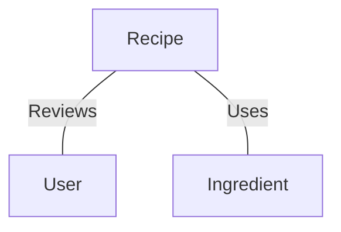

# The Data

For this project, we made use of the [`shuyangli94/food-com-recipes-and-user-interactions`](https://www.kaggle.com/datasets/shuyangli94/food-com-recipes-and-user-interactions) dataset. After cleaning the data and parsing it into a graph-native format, we were able to work with it under the following schema:

| Name                | Type | Count   |
| ------------------- | ---- | ------- |
| Recipe              | Node | 231636  |
| Ingredient          | Node | 14942   |
| User                | Node | 226570  |
| Recipe - User       | Edge | 1132366 |
| Recipe - Ingredient | Edge | 2096572 |
