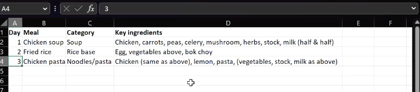

# User Research

## Methods

Our main goal in conducting user research was to figure out the pain points of the traditional recipe-searching experience.

- How hard is it to find a recipe that’s compatible with one’s taste preferences?
- How healthy do such recipes tend to be?
- When planning out multiple recipes, what aspects are important?
- Do people tend towards themes, or are chosen recipes independent of each other?

To answer this, we conducted zoom meetings with users and observed them through a screen share in “planning three days worth of dinners with online recipes”. After they completed the task, we conducted an exit interview where participants were asked about their typical eating habits and ranked the importance of certain factors in their decision.

## Findings

Our participants consisted of three adults: a male and female in their 50s and a male in his 20s.

- **Most People Don’t Use Recipes to Cook**
  - While a majority of participants utilized Google to find recipes, two-thirds of our participants only used said recipes as inspiration for food they already knew how to cook. Recipes such as homemade stews and rice bowls were some of the most common recipes reported and consequently rarely required a recipe. For such participants, much of the recipe-searching process instead boiled down to finding minor alterations to the food they enjoyed. They started their search using generic Google searches (ex: “easy dinner recipes”), then filtered through pre-curated lists for ideas on what to make.
- **Recipes Can Be Fact-Checkers**
  - Some users described the use of recipes as fact-checkers: allowing them to quickly look up established facts about a familiar recipe they may have forgotten (time it takes to cook, internal temperature to get to, etc.).
- **The Importance of On-Hand Ingredients**
  - Two participants explicitly stated that the recipes they chose were to minimize grocery trips (as one participant put it: “limit(ing) shopping trips to once-or-twice”). In follow-up interviews, both participants also ranked time as one of the most important aspects they look for in a dish, which ties into the total amount of time spent on cooking activities.

<figure>

<figcaption align="center">
<i>One participant went as far as to indicate what they already had / could use again in parentheses</i>
</figcaption>

</figure>
