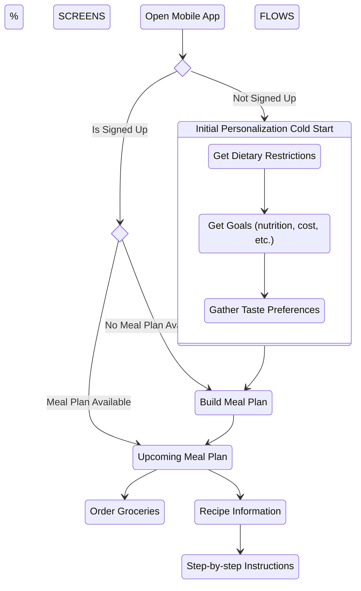
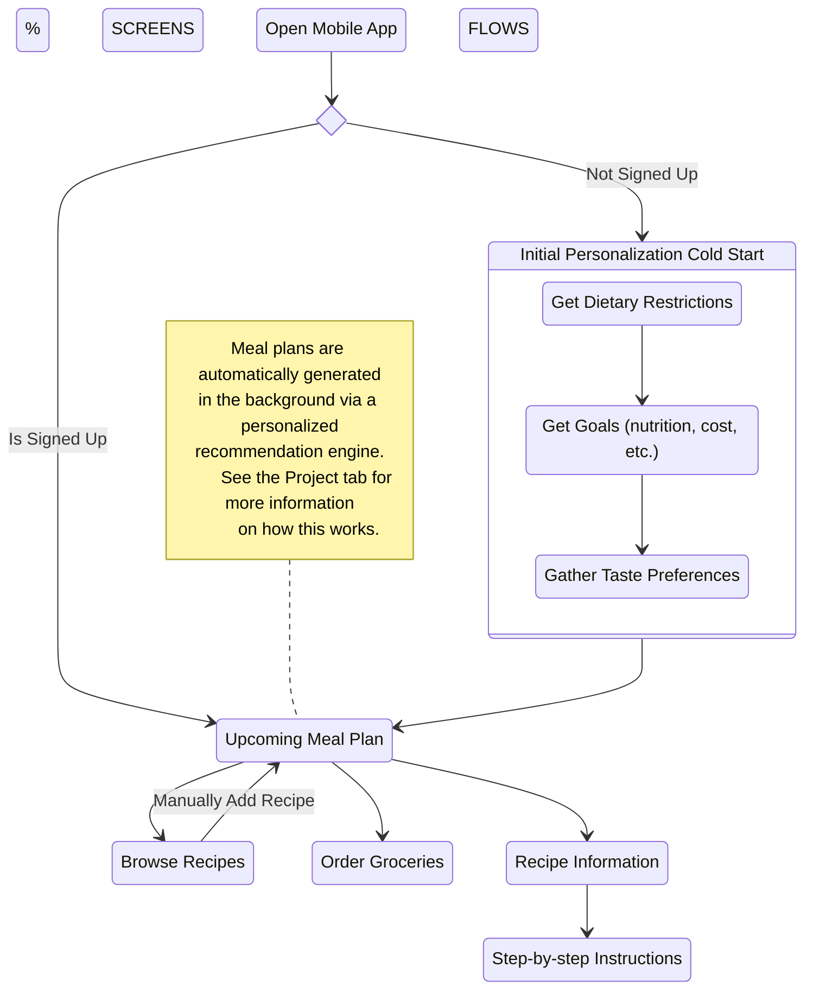

import Tabs from '@theme/Tabs';
import TabItem from '@theme/TabItem';
import UpcomingSketch from './images/ui-sketches/upcoming.png'
import BrowseSketch from './images/ui-sketches/browse.png'
import GroceriesSketch from './images/ui-sketches/groceries.png'
import RecipeSketch from './images/ui-sketches/recipe.png'
import InstructionsSketch from './images/ui-sketches/instructions.png'

# Early Ideation

## UX Flow

In order to solve the problems found in our user testing, we imagined two different UX flows. Both flows start when the user opens up the app.

### Manual

After signing up for the app, we imagined users going through the personalization process and really getting inspired by the foods they could cook. This is important because our app needs to be enticing enough to draw users away from the ease and comfort of ordering out. Afterwards, we attempt to continue user's excitement by quickly guiding them to build out their "dream meal plan".

### Automatic

Our second iteration builds off the manual flow by attempting to simplify the whole process. We realized particularly busy users might not have the mental energy to go about regularly crafting a meal plan, and thus tried to find a way to remove that requirement from the experience.

However, we still wanted to give users a way to build out their dream plans if they have the time. To do this, we made sure to include a way for users to reject the automated meal plans and even craft their own through a “Browse Recipes” screen.

## UI Sketches

With a rough idea of what the flow should now feel like, we set out to sketch out what the UI could look like. A few important ones are highlighted below.

<Tabs>
    <TabItem value="Upcoming Meal Plan">
        

            
        

         
        

            This screen is meant to quickly show users what their planned "meal of the day" is, as well as any ingredients needed for the recipe. We included the recipe ingredients as a way to show what's needed for the recipe (prompting users to pick them up on their way home if needed).
        

        

            In addition, we included a small section underneath the recipe we imagine could be personalized to the user. For this sketch, we imagined a user who's goal is to "eat healthier", and consequently show the nutritional information of the recipe. We specifically modeled this after the <a href="https://www.fda.gov/food/new-nutrition-facts-label/how-understand-and-use-nutrition-facts-label">FDA Nutrition Facts Label</a>, which most consumers will already be familiar with.
        

    </TabItem>
    <TabItem value="Browse Recipes">
        

            
        

         
        

        This screen is meant to give users the option to override the automatic recommendations and choose the recipes they want. We created this as a direct result of user testing, where we found most users historically find recipes in pre-curated lists. Instead of forcing these users to completely change their ways, we wanted to ease them into the app by supporting curated lists.
        

    </TabItem>
    <TabItem value="Order Groceries">
        

            
        

         
        This screen is meant to serve two purposes.
        <ol>
        <li>
            First, this screen optimizes users' existing grocery trips by breaking down what they need to buy for the week. Inspired by the grocery receipts at Safeway / Vons, we categorize every ingredient into the general area you may find it at a typical grocery store. We then display these items together to avoid users doubling back for later ingredients.
        </li>
        <li>
            Second, we provide a way for even the busiest of users to order ahead and pick everything up in one swoop.
        </li>
        </ol>
    </TabItem>
    <TabItem value="Recipe Information">
        

            
        

         
        This screen is meant to show users everything they'd want to know about a particular recipe. This includes things like a short description, the ingredients required, and the directions to make it.
    </TabItem>
    <TabItem value="Step-by-step Instructions">
        

            
        

         
        

            This screen expands on the recipe information by giving users an uninterrupted view of a particular step. We found from personal experience that it's nice to have a scaled up version of a some steps, particularly when your hands are full (as often the case in a kitchen).
        

        

            In addition, having a full-screen view allows us the possibility of adding more detailed information for each step. For complex recipes with a lot of moving parts, this could be especially helpful!
        

    </TabItem>

</Tabs>
