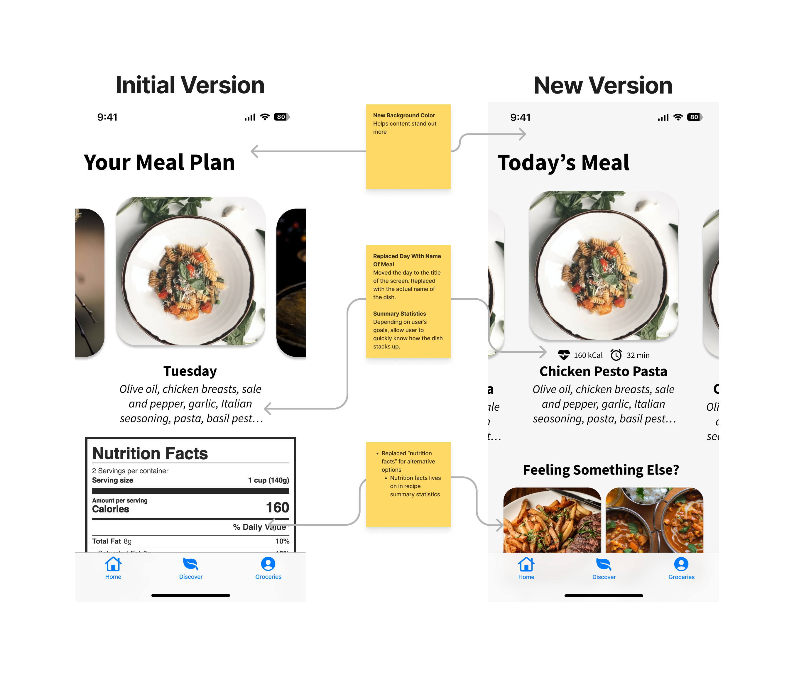
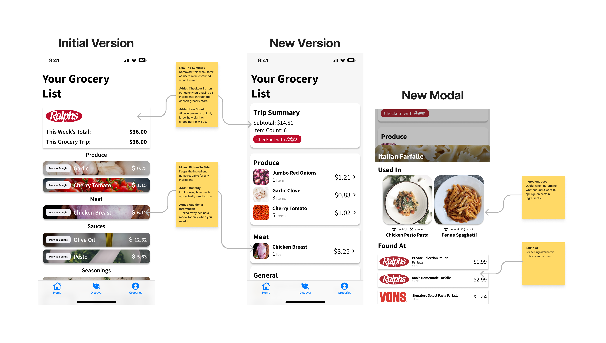

# Final Design

Our final design took the findings from the entire experience and condensed it into its final form. Note that this is an interactive design - feel free to play around with it!

<iframe
    style={{
        maxWidth: '100%',
        height: 'min(70vh, 700px)',
        aspectRatio: '390 / 844'
    }}
    src="https://www.figma.com/embed?embed_host=share&url=https%3A%2F%2Fwww.figma.com%2Fproto%2FDHAw5qL8tDpn4SssETdUWi%2FHiFi-Prototype%3Fpage-id%3D65%253A1559%26node-id%3D65%253A2007%26viewport%3D394%252C-227%252C0.26%26scaling%3Dscale-down%26starting-point-node-id%3D65%253A2007"
    allowfullscreen
></iframe>

## Changes

While we made a lot of changes over the previous prototype, we wanted to specifically call-out certain ones.

